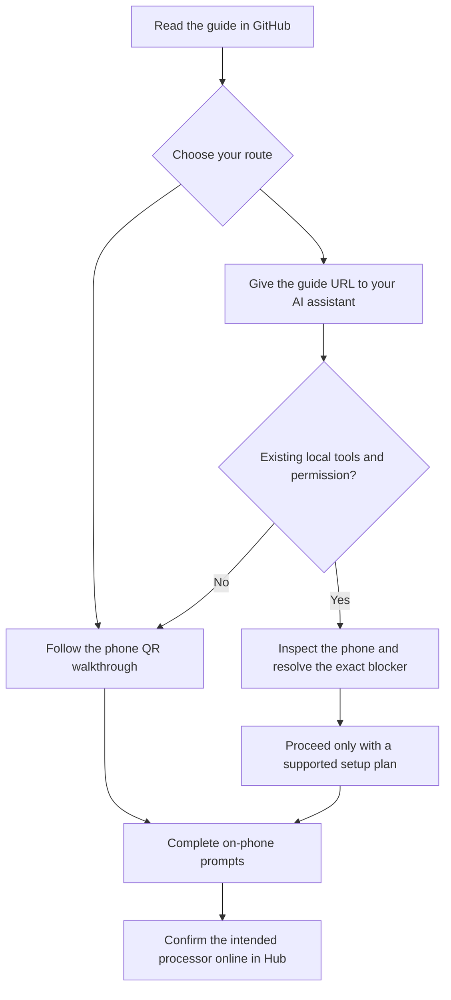

<p align="center">
  
</p>

<!-- Static for-the-badge / flat-square equivalents keep RepoFix badge styling available without third-party badge service uptime. -->
<p align="center">
  <a href="https://github.com/bokiko/acurast-core-onboarding-guide/blob/main/docs/start-here.md"></a>
  <a href="https://x.com/bokiko"></a>
</p>

<p align="center">
  
  
  
  <a href="LICENSE"></a>
</p>

<p align="center">
  <a href="docs/start-here.md"><strong>Start here</strong></a> ·
  <a href="docs/ai-assisted.md"><strong>Use an AI assistant</strong></a> ·
  <a href="docs/troubleshooting.md"><strong>Find your error</strong></a>
</p>

---

## Overview

Turn a dedicated Samsung, Xiaomi, or Pixel phone into an Acurast Core processor with practical instructions and fixes from real onboarding sessions. Read the steps yourself, or give Claude, Kimi, or Codex the guide URL and let an authorized local assistant help with the technical work.

> [!NOTE]
> **Read everything here on GitHub. No repository download, clone, or installation is needed.** Opening these pages does not install software, run commands, or access your phone. Installing Acurast on the phone is a separate step in its official setup flow.

This is an independent community guide. Core dedicates the phone to Acurast and can disable normal phone access; preserve needed data before setup. The unofficial USB method and its limits are clearly separated from the normal QR route.

---

## Quick Start

### Follow the steps yourself

1. Open **[Start here](docs/start-here.md)** in your browser.
2. Check your dedicated phone meets the requirements, then open your own **[Acurast Hub](https://hub.acurast.com/)** wallet session.
3. Follow the welcome-screen QR steps on the phone. If blocked, use the matching Samsung/Xiaomi instructions on the same page.
4. Confirm the intended processor shows **online** in your Hub.

### Let your AI assistant help

Open your existing assistant and paste this into its **chat box**, not a terminal:

```text
Read https://github.com/bokiko/acurast-core-onboarding-guide/blob/main/AI-ONBOARDING.md
and its linked guide pages directly from GitHub. Help me onboard my dedicated Android
phone to Acurast Core. Do not download or clone this repository, install computer tools,
or run installer scripts. Start by checking what access and tools you already have.
Explain each step simply and tell me exactly what to tap on the phone.
Ask before changing the phone. Never reset, flash, or change its bootloader without
my specific approval. Confirm the intended processor is online before calling it done.
```

> [!TIP]
> A local assistant can handle commands with your permission and existing tools. A browser-only chat can explain the steps but cannot automatically control your USB phone. **[AI-assisted setup](docs/ai-assisted.md)** explains both options.

---

## Features

<table>
<tr>
<td width="50%" valign="top">
<h3>Easy to follow</h3>
<ul>
<li>Read directly on GitHub</li>
<li>Exact phone menus and setup steps</li>
<li>Plain-language explanations of success and failure</li>
<li>No coding experience needed for the normal QR route</li>
</ul>
</td>
<td width="50%" valign="top">
<h3>Help when setup gets stuck</h3>
<ul>
<li>Samsung Auto Blocker and Play Protect notes</li>
<li>Xiaomi USB permission, SIM, and account findings</li>
<li>Error-by-error troubleshooting</li>
<li>Direct instructions for Claude, Kimi, and Codex</li>
</ul>
</td>
</tr>
</table>

---

## Tech Stack

| Part | What this guide uses |
| --- | --- |
| Documentation | GitHub Markdown, readable in a browser |
| Diagrams | Mermaid |
| Phone setup | Acurast Core and the phone's setup QR scanner |
| Optional assistance | Existing local AI/ADB tools, with owner permission |
| Technical reference | Java helper source for online review; no build/install workflow |
| Repository installation | **None required** |

---

## Architecture



---

## Project Structure

```text
acurast-core-onboarding-guide/
├── README.md                  # Start here on GitHub
├── AI-ONBOARDING.md            # Instructions to give any assistant by URL
├── AGENTS.md                  # Repository guidance for agents
├── CLAUDE.md                  # Claude entry point
├── docs/
│   ├── assets/                 # Static badges and related-project card
│   ├── start-here.md           # Complete beginner walkthrough
│   ├── ai-assisted.md          # Ready-to-paste AI prompt and instructions
│   ├── official-route.md       # Official-route summary
│   ├── samsung.md              # Samsung preparation
│   ├── xiaomi.md               # Xiaomi permission findings
│   ├── pixel.md                # Pixel field notes
│   ├── troubleshooting.md      # Find the exact error
│   ├── usb-onboarding.md       # Community method and prerequisites
│   ├── downloads.md            # App version/provenance reference only
│   ├── helper-review.md        # Technical review and limitations
│   ├── recovery.md             # Recovery boundaries
│   └── sources.md              # Evidence and upstream references
├── tools/
│   ├── CoreProvision.java     # Read-only technical reference
│   └── README.md              # Source context
├── .github/                   # Issue and pull request templates
├── CONTRIBUTING.md
└── LICENSE
```

---

<details>
<summary><b>Configuration & prerequisites</b></summary>

There is no repository configuration file, dependency installation, or API key to set up.

| Item | What to check |
| --- | --- |
| Phone | Owned by you and intended for dedicated Core use |
| Android | 12 or newer under the current published requirements |
| Firmware | Non-rooted, locked bootloader; do not unlock it for this guide |
| Data | Preserve needed files before any reset or account removal |
| Connection | Reliable internet and power |
| Hub | Your intended wallet/account, confirmed in your own browser |
| USB alternative | Existing suitable local tools and an explicitly authorized plan |

The official route starts with a factory reset. The guide explains the erase step before it happens. Requirements are summarized from [Acurast's provider guide](https://docs.acurast.com/processors/become-compute-provider/).

</details>

---

## Usage

### Choose the right page

| Situation | Open |
| --- | --- |
| First setup or welcome screen | [Complete walkthrough](docs/start-here.md) |
| Prefer AI help | [AI-assisted setup](docs/ai-assisted.md) |
| Samsung blocks setup | [Samsung steps](docs/samsung.md) |
| Xiaomi asks for a SIM/account | [Xiaomi steps](docs/xiaomi.md) |
| Pixel setup | [Pixel notes](docs/pixel.md) |
| An error message appears | [Troubleshooting](docs/troubleshooting.md) |
| Already-equipped assistant needs USB details | [Technical method](docs/usb-onboarding.md) |
| Modified firmware or incomplete lockdown | [Recovery boundaries](docs/recovery.md) |

### What completion looks like

**App installed → Core registered as device owner → paired to your Hub → confirmed online.** These are separate stages. An installed app or disappearing USB connection alone is not success.

### Our field results

Recorded **2026-09-09**, with **Core 1.27.1 (136)** using the community USB method. These are individual observations, not a compatibility certification or a promise for other firmware.

| Device | Android | Recorded result |
| --- | --- | --- |
| Samsung SM-A055F | 14 | Owner confirmed online |
| Google Pixel 6 Pro | 14 | Owner confirmed online |
| Samsung SM-A045F | 14 | Owner confirmed online after separate stock restoration/relock; Knox bit stayed tripped |
| Samsung SM-S918B | 15 | Owner registration and pairing launch confirmed; online confirmation not preserved |
| Xiaomi 23124RA7EO | 13 / MIUI 14 | Owner confirmed online after extra USB permissions and setup-account removal |

[App provenance](docs/downloads.md) · [Helper limitations](docs/helper-review.md) · [Sources](docs/sources.md)

---

## Roadmap

- [x] Browser-readable beginner walkthrough
- [x] Samsung, Xiaomi, and Pixel field notes
- [x] Exact-error troubleshooting
- [x] Direct GitHub instruction URL for AI assistants
- [x] Clear distinction between observed results and unverified behavior
- [ ] More independently reproduced device/firmware results
- [ ] Sanitized screenshots of setup prompts
- [ ] Fresh end-to-end validation of the reviewed helper variant

---

## Related Projects

<a href="https://github.com/bokiko/RepoFix">
  
</a>

[RepoFix](https://github.com/bokiko/RepoFix) defines the shared presentation standards used here.

---

## Contributing

Use GitHub's website to [report a result or suggest a correction](CONTRIBUTING.md). Include the model, software version, exact sanitized error and last successful stage. Keep real QR data, account details, serials and unreviewed logs private. No local clone is needed to open an issue or suggest an edit.

---

## License

MIT — see [LICENSE](LICENSE).

---


<p align="center">
  Made by <a href="https://bokiko.io">@bokiko</a>
</p>
